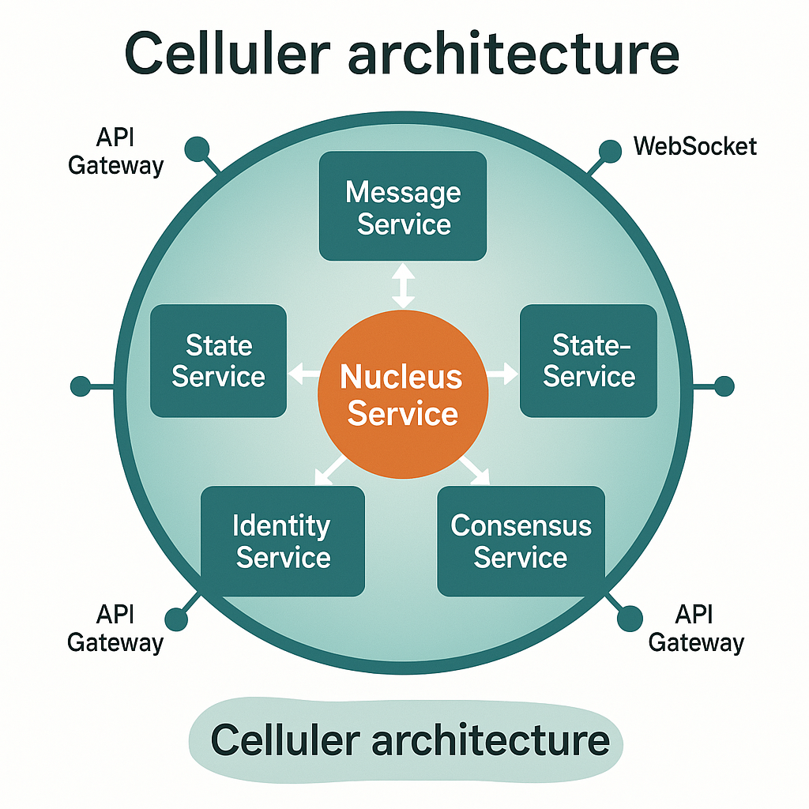

# Architecture Overview

## System Design

Celluler is designed as a distributed system where each node (cell) is both a self-contained unit and part of a larger network. The architecture is built on several key technologies and principles:

### Core Technologies

1. **Moleculer Framework**
   - Internal service architecture
   - Service discovery and communication
   - Load balancing and fault tolerance
   - Metrics and monitoring

2. **Hypercore Protocol**
   - Distributed append-only logs for message journals
   - Cryptographic message history and verification
   - Peer-to-peer data sharing
   - Data encryption and access control
   - Identity verification through social interaction history

3. **Consensus Algorithm (Hashgraph)**
   - Byzantine fault tolerance
   - Fair ordering
   - Fast finality
   - Secure propagation

## Cell Architecture

A cell is implemented as a cluster of microservices, each maintaining its own Hypercore journal and participating in the Hashgraph consensus network. The services work together to provide the cell's functionality while maintaining data integrity and security.




### Core Services

1. **NucleusService**
   - Central configuration and coordination point for the cell
   - Manages the cell's Hypercore journal
   - Handles service registration and discovery
   - Maintains cell metadata and configuration
   - Coordinates service lifecycle and dependencies
   - Provides centralized access control for Hypercore modifications

2. **MessageService**
   - Handles message routing and delivery
   - Implements message protocol
   - Manages Hypercore-based message journals
   - Provides message verification and identity proofs
   - Maintains a Hypercore journal of all incoming/outgoing messages

3. **StateService**
   - Maintains local state
   - Syncs with global state through Hashgraph consensus
   - Handles state transitions
   - Manages state verification
   - Stores state history in a Hypercore journal

4. **IdentityService**
   - Manages cell identity verification
   - Maintains trust networks
   - Handles social interaction proofs
   - Implements reputation systems
   - Stores identity and trust data in a Hypercore journal

5. **ConsensusService**
   - Participates in Hashgraph consensus
   - Propagates events to other cells
   - Validates received events
   - Maintains consensus state
   - Stores consensus history in a Hypercore journal

### Service Coordination

Services within a cell coordinate through:
- NucleusService as the central coordinator
- Moleculer service bus for internal communication
- Shared read access to Hypercore journals (write access through NucleusService)
- Participation in the Hashgraph consensus network
- Event-driven architecture for state synchronization

### Data Storage

Each service maintains its own Hypercore journal:
- NucleusService manages write access to all Hypercore journals
- Services have direct read access to their respective journals
- Append-only log of all state changes
- Cryptographic verification of data integrity
- Efficient peer-to-peer synchronization
- Access control and encryption
- Version history and rollback capabilities

## Messaging Protocol

### Message Structure

```typescript
interface Message {
    timestamp: number;
    sender: string;    // Cell ID
    receiver: string;  // Cell ID
    type: MessageType;
    body: any;
    signature: string; // Cryptographic signature
    proof: string;     // Identity proof
}

enum MessageType {
    CHAT = 'CHAT',     // Human-readable communication
    AUTH = 'AUTH',     // Authentication and identity verification
    TX = 'TX',         // Transactional data
    POST = 'POST',     // Content shared to global dataset
    QUERY = 'QUERY',   // Requests for data from global dataset
    EXEC = 'EXEC'      // Execution requests
}
```

### Message Flow

1. **Message Creation**
   - Service creates message with appropriate type and body
   - IdentityService signs message with cell's private key
   - MessageService adds timestamp and routing information

2. **Message Routing**
   - MessageService determines target cell(s)
   - Uses P2P network to deliver message
   - Maintains delivery status in Hypercore journal

3. **Message Processing**
   - Receiver validates message signature and proof
   - Appropriate service processes message based on type
   - State changes recorded in respective Hypercore journals
   - Consensus events propagated through Hashgraph network

## Network Architecture

### Cell-to-Cell Communication

1. **Direct P2P Connections**
   - Secure WebSocket connections between cells
   - Message routing and delivery
   - Connection management and health monitoring

2. **Consensus Network**
   - Hashgraph-based event propagation
   - Byzantine fault tolerance
   - Fair ordering of events
   - State synchronization

3. **Discovery and Bootstrap**
   - Initial peer discovery
   - Bootstrap node configuration
   - Network self-organization
   - Dynamic peer management

### Security Model

1. **Identity Verification**
   - Cryptographic signatures
   - Social proof verification
   - Trust network validation
   - Reputation-based access control

2. **Data Protection**
   - End-to-end encryption
   - Access control lists
   - Data integrity verification
   - Secure key management

## Deployment Architecture

### Single Cell Deployment

1. **Service Configuration**
   - Moleculer service registry
   - Hypercore storage configuration
   - Consensus network settings
   - Security parameters

2. **Resource Management**
   - CPU and memory allocation
   - Storage requirements
   - Network bandwidth
   - Service scaling

### Multi-Cell Deployment

1. **Network Topology**
   - Cell interconnection patterns
   - Consensus network structure
   - Message routing optimization
   - Load balancing

2. **Resource Distribution**
   - Distributed storage
   - Compute resource allocation
   - Network bandwidth management
   - Service replication

## Monitoring and Observability

1. **Service Metrics**
   - Moleculer service health
   - Message throughput
   - Consensus participation
   - Resource utilization

2. **Network Metrics**
   - P2P connection status
   - Message delivery rates
   - Consensus performance
   - Network topology

3. **Security Metrics**
   - Identity verification rates
   - Message validation success
   - Access control events
   - Security incidents

## Market Architecture

### Market Types

1. **Global Market (PRANA)**
   - Universal participation
   - Common token balance
   - Base currency for all transactions
   - Global state consensus

2. **Resource Markets**
   - Compute resource trading
   - Data storage trading
   - Resource allocation
   - Price discovery

3. **Specialized Markets**
   - AI model training
   - Data sharing
   - Service provision
   - Custom applications

### Market Mechanics

1. **Cooperative Games**
   - Trust-based interactions
   - Resource pooling
   - Profit sharing
   - Reputation systems

2. **Resource Allocation**
   - Dynamic pricing
   - Load balancing
   - Quality of service
   - Fair distribution

3. **Token Economics**
   - PRANA as base currency
   - Market-specific tokens
   - Cross-market trading
   - Value transfer

## Security Architecture

### Data Security
- End-to-end encryption
- Message signing
- Access control
- Data verification

### Market Security
- Byzantine fault tolerance
- Fair ordering
- Transaction verification
- State consistency

## Scalability

The system is designed to scale through:

1. **Horizontal Scaling**
   - Multiple cells
   - Distributed markets
   - Resource sharing
   - Load balancing

2. **Vertical Scaling**
   - Resource optimization
   - Performance tuning
   - Caching strategies
   - State management

## Deployment Options

Cells can be deployed in various configurations:

1. **Single Machine**
   - All services on one machine
   - Good for development and testing

2. **Cluster**
   - Services distributed across machines
   - Better for production workloads

3. **Hybrid**
   - Mix of single and clustered deployments
   - Flexible resource allocation

## Future Considerations

1. **Planned Features**
   - Sharding support
   - Cross-chain compatibility
   - Advanced AI model distribution
   - Enhanced security features

2. **Research Areas**
   - Optimizing consensus performance
   - Improving data distribution
   - Enhancing AI model collaboration
   - Advanced security mechanisms 